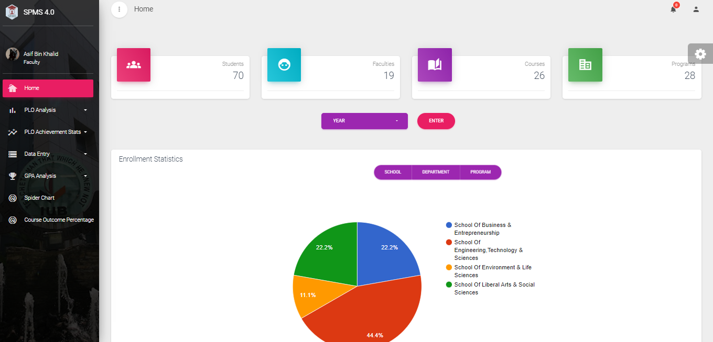

# Student Performance Monitoring System
This web based Student Performance Monitoring System is a comprehensive platform designed to assist academic institutions in tracking and analyzing the academic performance of their students.
The system allows faculty members to record grades, and other academic data in real-time, providing valuable insights into student performance. This information can be easily accessed by administrators and faculty, allowing them to identify trends and patterns and make data-driven decisions to improve student outcomes.

# Depedencies
1. PHP (Version 7.1)
2. dompdf (Version 2.0.3)
3. Bootstrap 4
4. Google Charts

# How to run
Import spmsv4_core(2).sql file from the Database files folder

# Login Credentials
Student
+ ID: 1531176
+ Password: 12345
+ ID: 1910876
+ Password: 12345

Faculty
+ ID: 4408
+ Password: 12345
+ ID: 2259
+ Password: 12345

# Webpage

# Contributors
+ Ikkty Rahman
+ Maha Murshed
+ SK Sadia Tasnim Elma
+ Noorjahan Sayeed
+ Sumaya
+ Bushra Jahangir

